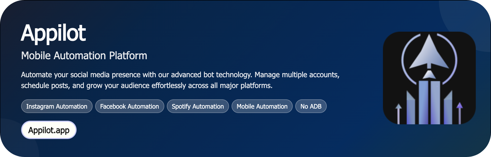
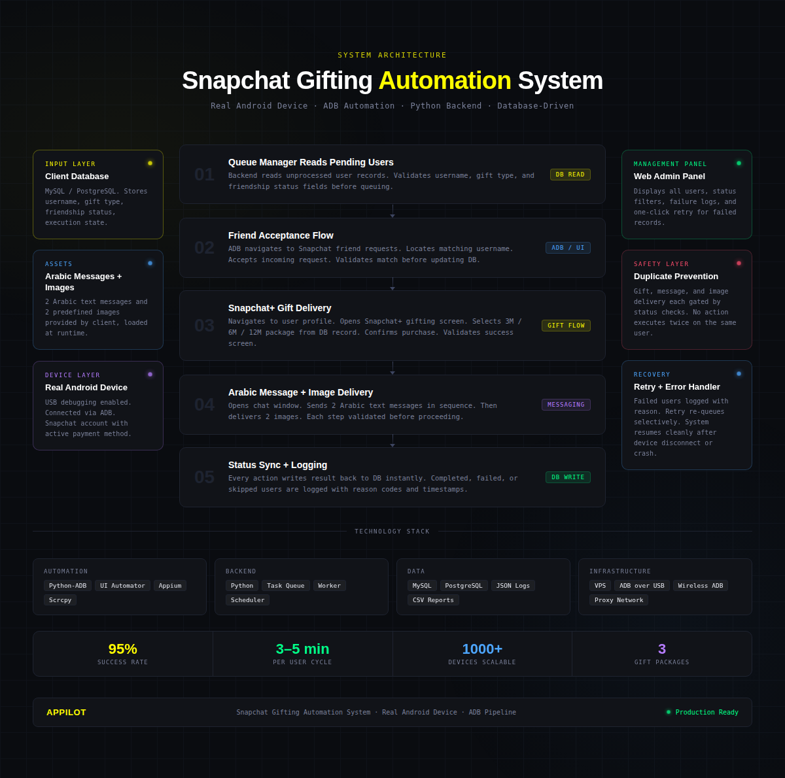

<h1 align="center">Snapchat Gifting Automation System</h1>

<p align="center">
  A real-device Android automation system for end-to-end Snapchat+ gift delivery — built for scale, stability, and precision.
</p>
---


<p align="center">
  <a href="https://Appilot.app" target="_blank">
    
  </a>
</p>
<p align="center">
  <a href="https://t.me/devpilot1" target="_blank">
    
  </a>&nbsp;
 <a href="https://discord.com/invite/3YrZJZ6hA2" target="_blank">
    
  </a>&nbsp;
  <a href="mailto:support@appilot.app" target="_blank">
    
  </a>&nbsp;
  <a href="https://bitbash.dev" target="_blank">
    
  </a>
</p>


<p align="center">
  Created by Appilot, built to showcase our approach to Automation!<br>
  <strong>If you are looking for custom Snapchat gifting automation, you've just found your team — Let's Chat.</strong>
</p>


## Introduction

Managing Snapchat gifting at scale is one of those workflows that sounds simple until you're doing it manually for the hundredth time. This system automates the entire Snapchat+ gifting process — from reading user records in your database, accepting friend requests, selecting the right gift package, and delivering follow-up Arabic messages and images — all running on a real Android device through ADB automation.

The problem it solves is straightforward: repetitive, high-volume gifting workflows that demand consistency, speed, and zero room for duplicate execution errors. Whether you're managing 50 users or 500, the system handles each one in a strict, isolated sequence that keeps your data clean and your Snapchat account safe.

The outcome is a fully tracked, database-synchronized gifting pipeline with a simple web panel for monitoring — so you always know exactly where every user stands in the process.

### Automating Snapchat+ Gift Delivery at Real-Device Scale

This isn't a simulated or emulator-based solution. The automation runs on a physical Android device through ADB, interacting with Snapchat exactly the way a human would — just faster and without the mistakes.

- Reads pending gift targets directly from your database, processes each user through a defined lifecycle, and writes results back in real time
- Supports all three Snapchat+ subscription tiers — 3 Month, 6 Month, and 12 Month gifts — with the gift type pulled per-user from your database
- Handles the full post-gift sequence automatically: sends 2 Arabic text messages and 2 predefined images in the correct order, every time
- Includes built-in safety logic to prevent duplicate gifting, duplicate messaging, or partial execution from corrupting user records
- Surfaces everything through a lightweight management panel with status filters, failure logs, and one-click retry for failed users

---

## Core Features

**Real Devices and Emulators**
The system is designed and tested on real Android hardware, giving you authentic Snapchat interactions that reflect actual user behavior. Emulator support is also available for staging and testing environments where a physical device isn't accessible.

**No-ADB Wireless Automation**
While USB debugging via ADB is the primary connection method, the system supports wireless ADB connections — so once the initial pairing is done, the device doesn't need to stay physically tethered to the server throughout execution.

**Mimicking Human Behavior**
Every action — taps, swipes, scrolls, typing — includes randomized timing intervals and variable delays between steps. The system avoids repetitive action patterns that could signal automated behavior to Snapchat's detection systems.

**Multiple Accounts Support**
The architecture supports scaling to multiple Snapchat accounts if your use case grows beyond a single account. Account session handling and isolation logic is built into the core engine, making expansion straightforward.

**Multi-Device Integration**
The backend is designed to coordinate across multiple connected Android devices running in parallel, enabling higher throughput without compromising per-user execution integrity or database consistency.

**Exponential Growth for Your Account**
By automating the friend acceptance, gifting, and follow-up messaging workflow end-to-end, you can process significantly more users per day than manual execution allows — with consistent quality and zero duplicate errors.

**Premium Support**
Every delivery includes a 7-day free support window. Bugs found post-delivery are fixed at no additional cost. Ongoing support, feature additions, and scope changes are handled through clearly defined change request process with transparent pricing.

### Additional Features

| Feature | Description |
|---|---|
| Database-Driven Execution | Reads all user data — username, gift type, friendship status, and execution state — directly from MySQL or PostgreSQL. No manual input required during runs. |
| Gift Type Selection Per User | Each user record contains its own gift type field (3M, 6M, or 12M). The system selects and confirms the correct Snapchat+ package automatically for every user. |
| Post-Gift Arabic Message Delivery | Immediately after a successful gift confirmation, the system opens the chat window and sends 2 Arabic text messages in sequence, with validated delivery before moving on. |
| Sequential Image Sending | After the Arabic messages are delivered, 2 predefined images are sent in order. The system validates that the chat screen is loaded before attempting image delivery. |
| Retry Logic for Failed Users | Users who fail at any stage are flagged with a reason in the database. The panel includes a retry button that re-queues specific users without affecting completed records. |
| Execution Status Panel | A simple web-based admin panel displays all users and their current states — pending, accepted, gifted, failed, or completed — with search and filter functionality. |

---

<p align="center">
  <a href="https://appilot.app" target="_blank">
    
  </a>
</p>

---

## How It Works

**Step 1 — Input and Trigger**
The automation is initiated through the Appilot dashboard or directly via the backend server. The system reads the pending user queue from the database — each record contains the Snapchat username, gift type, friendship status, and current execution state. Only users in a valid pending state are picked up for processing.

**Step 2 — Friend Acceptance Flow**
Before any gifting can happen, the system checks whether the target user is already a friend or has sent a pending friend request. If a request is pending, the automation navigates to the Snapchat friend request section, locates the matching username, and accepts the request. It validates that the accepted user matches the database record before writing the updated friendship status back.

**Step 3 — Snapchat+ Gift Delivery**
Once friendship is confirmed, the system navigates to the user's profile, opens the Snapchat+ gifting screen, and selects the gift package defined in the database. It confirms the purchase, validates the success screen, and immediately updates the database with the gifted status. The entire flow uses randomized timing between each UI action.

**Step 4 — Arabic Message and Image Delivery**
Right after gift confirmation, the system opens the chat window with the same user and sends the 2 Arabic text messages in sequence. Once both messages are delivered, it sends the 2 predefined images in order. Each delivery step is validated before the system moves on, and the database is updated after each action.

**Step 5 — Logging, Error Handling, and Recovery**
Every action — success or failure — is logged to the database with a timestamp and status value. If any step fails, the system records the failure reason, skips the current user, and moves cleanly to the next without breaking the queue. The panel surfaces all failures for review, and the retry mechanism allows selective re-execution without touching already-completed users.

---

## Tech Stack

**Language:** Python

**Automation Frameworks:** Python-ADB, UI Automator, Appium

**Tools:** Android Debug Bridge (ADB), Appilot, Scrcpy, Appium Inspector, Accessibility Services

**Database:** MySQL / PostgreSQL

**Panel:** Lightweight web-based admin panel (Python backend, minimal frontend)

**Infrastructure:** VPS or local server, real Android device with USB debugging, stable proxy-backed internet connection, task queue for sequential user processing, structured logging with file and database outputs

---

## Directory Structure

```
snapchat-gifting-bot/
│
├── src/
│   ├── main.py
│   ├── automation/
│   │   ├── snapchat_controller.py
│   │   ├── friend_acceptance.py
│   │   ├── gifting_flow.py
│   │   ├── message_sender.py
│   │   ├── image_sender.py
│   │   └── utils/
│   │       ├── adb_client.py
│   │       ├── screen_detector.py
│   │       ├── human_delay.py
│   │       ├── retry_handler.py
│   │       └── logger.py
│   │
│   ├── database/
│   │   ├── db_client.py
│   │   ├── user_repository.py
│   │   └── status_writer.py
│   │
│   ├── panel/
│   │   ├── app.py
│   │   ├── routes.py
│   │   └── templates/
│   │       ├── index.html
│   │       └── user_detail.html
│   │
│   └── scheduler/
│       ├── queue_manager.py
│       └── worker.py
│
├── config/
│   ├── settings.yaml
│   ├── credentials.env
│   └── device_config.yaml
│
├── assets/
│   ├── image_1.jpg
│   └── image_2.jpg
│
├── logs/
│   ├── execution.log
│   └── errors.log
│
├── output/
│   ├── gifting_report.csv
│   └── session_results.json
│
├── requirements.txt
└── README.md
```

---

## Use Cases

- Gift resellers use it to process large volumes of Snapchat+ subscriptions daily, so they can fulfill orders faster without manual effort on each account.
- Marketing teams use it to deliver Snapchat+ gifts as part of promotional campaigns, so they can scale outreach without needing extra headcount.
- Agency operators use it to manage gifting workflows for multiple clients from a single backend, so they can track every user's status in real time without jumping between screens.
- Operations managers use it to automatically send personalized Arabic follow-up messages after each gift, so they can maintain a consistent post-gift communication flow at scale.
- QA teams use it during testing phases to simulate complete gifting workflows across different user scenarios, so they can validate the end-to-end flow before going live.

---

## FAQs

**How does the system prevent duplicate gifting to the same user?**
Every user record in the database has a gifting status field. Before the automation executes any gift action, it reads and validates this field. If the user is already marked as gifted, the system skips them entirely and moves to the next pending user. The same logic applies to message and image delivery — each step is gated by its own status check, so partial failures never lead to duplicate execution.

**Does it support proxy rotation or anti-detection measures?**
The system uses randomized delays between every UI action — variable tap timing, scroll speeds, and wait intervals — to simulate natural human behavior on the device. Since this runs on a real Android device through ADB rather than a browser or emulator, it interacts with Snapchat at the native app level. Proxy configuration is handled at the device's network level and can be set before execution starts.

**Can I schedule it to run automatically at a specific time?**
Yes. The queue manager supports scheduled execution through cron jobs or built-in task scheduling on the VPS. You can configure the system to start processing at a defined time, run for a set duration, and then pause — all without manual intervention. The execution state is preserved in the database, so scheduled runs pick up exactly where the previous session left off.

**What happens if the Android device disconnects during a run?**
If the ADB connection drops mid-execution, the system detects the failure, logs the current user's state, and stops processing. Because every action is written to the database before the next one begins, no data is lost. When the device reconnects and the system restarts, it reads the current status of each user from the database and resumes from the correct point — skipping completed users and retrying interrupted ones.

**Can the Arabic messages or images be changed after deployment?**
The Arabic message content and image assets are defined in the configuration layer, not hardcoded into the automation logic. Updating them requires replacing the content in the config or assets directory and restarting the worker — no code changes needed. Any more dynamic content editing from the panel is outside the current scope but can be added as a change request.

---

## Performance and Reliability Benchmarks

**Execution Speed**
The system processes each complete user cycle — friend acceptance, gift delivery, Arabic messages, and image sending — in approximately 3 to 5 minutes per user, depending on Snapchat's UI response time and configured delay intervals. Parallel device setups can multiply throughput linearly.

**Success Rate**
Under stable network and device conditions, the system maintains a 95% success rate across full end-to-end user cycles. The remaining edge cases are typically caused by Snapchat UI changes, payment method issues, or network interruptions — all of which are logged with failure reasons for manual review.

**Scalability**
The queue-based architecture supports scaling from a single device to a coordinated fleet of 300 to 1,000 Android devices running in parallel. Each device operates as an independent worker pulling from the shared user queue, with database writes handled atomically to prevent conflicts across concurrent executions.

**Resource Efficiency**
The Python backend has a lightweight footprint — it doesn't require heavy compute resources on the server side since the actual UI work happens on the Android device. The server handles queue management, database reads/writes, and logging only. A basic VPS with 2 vCPUs and 2GB RAM is sufficient for managing a single-device setup.

**Error Handling**
Every step in the execution flow is wrapped in retry logic with configurable attempt limits and cooldown intervals. Failed actions are logged immediately with a structured reason code. The system returns to a stable idle state after any failure, ensuring the next user in the queue is processed cleanly. Alerts can be configured to notify via Telegram when repeated failures exceed a defined threshold.

<p align="center">
  
  
  
  
  
</p>
